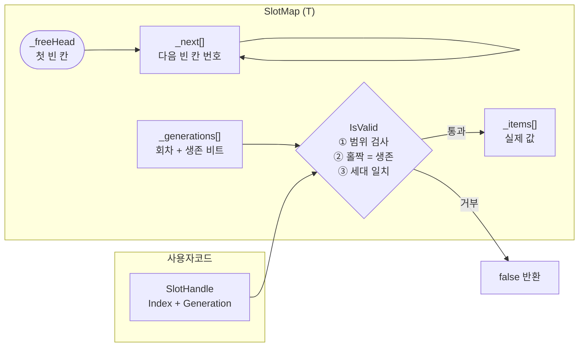
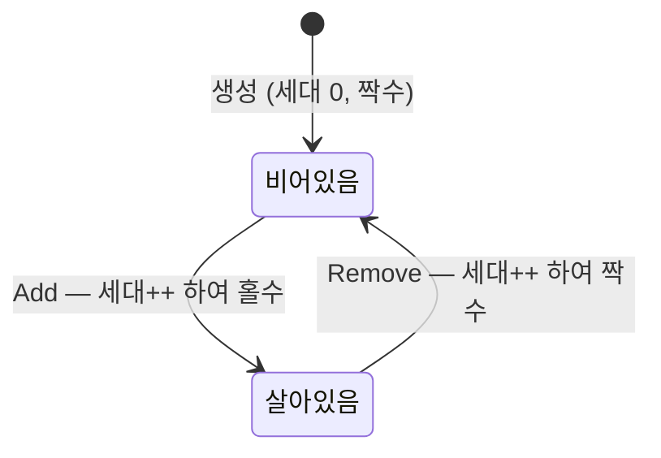

# FreeList — 인덱스 기반 SlotMap

> 빈 칸 목록을 위한 별도 자료구조 없이, 빈 칸 자체에 "다음 빈 칸 번호"를 적어 관리하는 자료구조. C#으로 밑바닥부터 구현하며 배운 기록.

---

## 1. 프로젝트 소개

### 왜 만들었나

객체를 자주 만들고 버리는 프로그램(게임, 서버)에서는 GC 부담을 줄이기 위해 미리 배열을 잡아두고 슬롯을 재사용한다. 이때 **"어느 칸이 비어 있는가"를 어떻게 기억할 것인가**가 문제가 된다.

가장 단순한 답은 `Stack<int>`에 빈 인덱스를 넣어두는 것이다. 동작은 하지만 원소 100만 개짜리 배열이면 최악의 경우 100만 개짜리 스택이 하나 더 필요하다. **메모리를 아끼려고 만든 구조가 메모리를 두 배로 쓴다.**

FreeList의 발상은 이렇다.

> **빈 칸은 어차피 아무도 안 쓴다. 그 자리에 "다음 빈 칸 번호"를 적어두자.**

추가 메모리 없이 빈 칸 목록이 만들어지고, 할당·반납이 모두 O(1)이 된다.

### 무엇을 목표로 했나

단순히 동작하는 코드가 아니라, **각 결정이 왜 그래야 하는지**를 이해하는 것이 목적이었다. 그래서:

- 기능을 한 번에 만들지 않고, 한 단계씩 쌓으며 매 단계 커밋을 남겼다
- 문제를 겪은 뒤에 해법을 도입했다 (예: 인덱스만으로 생기는 버그를 재현한 뒤에 세대 핸들을 붙임)
- 모든 버그를 회귀 테스트로 고정해 되살아나지 않게 했다

### 범위

학습용 프로젝트다. 단일 스레드 전용이며, 프로덕션 사용을 목표로 하지 않는다. 다만 실무에서 실제로 쓰이는 기법(세대 핸들, 조건부 참조 정리, 할당 없는 열거자)을 그대로 구현했다.

---

## 2. 기술 스택

| 분류 | 기술 |
|------|------|
| Language | C# 13 |
| Runtime | .NET 10.0 |
| Test Framework | xUnit 2.9.3 |
| Test SDK | Microsoft.NET.Test.Sdk 17.14.1 |
| Test Runner | xunit.runner.visualstudio 3.1.4 |
| Coverage | coverlet.collector 6.0.4 |
| IDE | JetBrains Rider |

특별한 외부 의존성은 없다. 자료구조 본체는 **BCL만으로** 구현했다.

---

## 3. 시스템 아키텍처

### 전체 구조



세 배열의 길이는 **항상 같다**. 같은 인덱스 `i`가 세 배열에서 같은 슬롯의 서로 다른 측면을 가리킨다.

| 배열 | 언제 유효한가 |
|---|---|
| `_items[i]` | 슬롯이 **살아있을 때** |
| `_next[i]` | 슬롯이 **비어 있을 때** (살아있으면 낡은 값, 아무도 안 읽음) |
| `_generations[i]` | **항상** (하위 1비트 = 생존 여부, 나머지 = 발급 회차) |

### 슬롯의 생애



`Add`와 `Remove`가 각각 세대를 1씩 올리므로 **상태가 바뀔 때마다 최하위 비트가 토글된다.** 정수 하나가 "몇 번째 주인인가"와 "지금 살아있는가"를 동시에 표현한다.

### free 체인이 동작하는 모습

```
용량 5, 1번과 3번이 비어있는 상태

index:      0        1        2        3        4
         ┌──────┐ ┌──────┐ ┌──────┐ ┌──────┐ ┌──────┐
_items   │  A   │ │      │ │  C   │ │      │ │  E   │
_next    │  -   │ │  3   │ │  -   │ │  -1  │ │  -   │
_gen     │  1   │ │  2   │ │  1   │ │  4   │ │  1   │
         └──────┘ └──────┘ └──────┘ └──────┘ └──────┘
                      ↑                  ↑
_freeHead = 1 ────────┘                  │
                      └── _next=3 ───────┘
                                         └── _next=-1 (체인 끝)
```

`Add`는 `_freeHead`가 가리키는 칸을 가져가고, `Remove`는 반납한 칸을 체인 **맨 앞**에 꽂는다. 맨 뒤에 붙이려면 끝까지 걸어가야 해서 O(n)이 되므로, 앞에 꽂아 O(1)을 유지한다. 그 결과 **가장 최근에 반납한 칸이 먼저 재사용된다(LIFO)**.

---

## 4. 핵심 기능

### 공개 API

| 시그니처 | 설명 |
|---|---|
| `SlotMap(int capacity = 1024)` | 용량 지정 생성. 0 이하면 `ArgumentException` |
| `SlotHandle Add(T item)` | 빈 칸에 넣고 핸들 발급. 가득 차면 용량을 2배로 늘림 |
| `bool Remove(SlotHandle handle)` | 제거 성공 시 `true`. 무효 핸들이면 `false` |
| `bool TryGet(SlotHandle handle, out T value)` | 살아있으면 값과 함께 `true` |
| `int Count { get; }` | 살아있는 원소 수 |
| `Enumerator GetEnumerator()` | 살아있는 원소만 도는 열거자 |

밖에서 슬롯에 닿는 길은 **`SlotHandle` 뿐이다.** 원시 인덱스를 받는 오버로드는 전부 `private`이고, `SlotHandle`의 생성자는 `internal`이라 발급 권한은 `SlotMap`만 갖는다.

### 기능별 동작

**O(1) 할당과 반납** — free 체인의 머리를 뽑고 꽂는 것이 전부다. 탐색이 없다.

**이중 반납 차단** — 같은 칸을 두 번 반납하면 `_next[i] = i`가 되어 체인이 자기 자신을 가리킨다. 이후 모든 `Add`가 같은 칸을 반환하며 데이터가 조용히 덮어써진다. 생존 검사로 두 번째 반납을 거부한다.

**옛 핸들 차단 (세대)** — 칸이 재사용되면 옛 인덱스가 새 주인을 가리킨다. `Remove`가 세대를 올리는 것만으로 **그 칸을 가리키던 모든 옛 핸들이 한 번에 무효**가 된다. 옛 핸들 목록을 관리할 필요가 없다.

**타입에 따른 조건부 참조 정리** — `T`가 참조를 품은 타입일 때만 반납 시 슬롯을 비운다. `RuntimeHelpers.IsReferenceOrContainsReferences<T>()`는 JIT가 타입별 상수로 접기 때문에, `SlotMap<int>`로 만든 코드에서는 분기 자체가 사라진다.

**자동 확장** — 가득 차면 용량을 2배로 늘린다. 새 구간의 꼬리를 기존 `_freeHead`에 연결하므로, "가득 찼을 때만 확장한다"는 가정 없이도 옛 빈 칸이 유실되지 않는다.

**할당 없는 순회** — 구조체 열거자를 쓰고 `IEnumerable<T>`를 구현하지 않는다. `GetEnumerator()` 메서드만 있으면 `foreach`가 동작하므로(덕 타이핑), 인터페이스를 거치지 않아 박싱이 없다.

### 테스트

xUnit 테스트 **39개**. 모든 테스트는 실제로 겪은 버그 하나씩을 붙잡고 있다.

| 그룹 | 개수 | 대표 항목 |
|---|---|---|
| 생성자 | 3 | `capacity가_1이어도_동작한다` (경계값) |
| Add | 5 | `초기_체인이_전체_칸을_잇는다` |
| Remove | 6 | `이중_제거_후에도_체인이_망가지지_않는다` |
| 재사용 | 3 | `재사용_순서는_LIFO다` |
| TryGet | 4 | `저장된_마이너스1과_실패는_구분된다` |
| 세대 핸들 | 5 | `확장을_건너뛴_옛_핸들도_거부된다` |
| 확장 | 3 | `확장_후에도_기존_데이터가_살아있다` |
| GC 누수 | 1 | `참조_타입을_제거하면_GC가_수거한다` |
| 종합(랜덤) | 2 | `죽은_핸들은_언제나_거부된다` |
| 순회 | 7 | `중첩_순회는_서로_간섭하지_않는다` |

특히 **랜덤 스트레스 테스트 2종**이 손으로 짠 시나리오가 놓치는 조합을 잡는다. 고정 시드를 써서 실패하면 그대로 재현된다.

- `랜덤_5000회_동안_불변식이_유지된다` — 매 스텝 `Count == 실제 생존 수`, 살아있는 핸들 재발급 없음, 값 무결성
- `죽은_핸들은_언제나_거부된다` — 죽은 핸들 20개를 매 스텝 다시 찔러 하나라도 통과하면 실패

---

## 5. 설치 및 실행 가이드

### 사전 요구사항

- .NET SDK 10.0 이상

### 클론 및 실행

```bash
git clone https://github.com/SeoBYP/FreeList.git
cd FreeList

# 빌드
dotnet build

# 테스트 (39개)
dotnet test

# 데모 실행
dotnet run --project FreeList
```

### 사용 예시

```csharp
var map = new SlotMap<string>(8);

var goblin = map.Add("고블린");
var orc    = map.Add("오크");

map.Remove(goblin);              // 고블린 제거
var dragon = map.Add("드래곤");   // 같은 칸을 재사용

map.TryGet(goblin, out _);       // false — 옛 핸들은 막힌다
map.TryGet(dragon, out var v);   // true, v == "드래곤"

foreach (var (handle, value) in map)
    Console.WriteLine($"{handle} = {value}");   // 살아있는 것만
// #0(g3) = 드래곤
// #1(g1) = 오크
```

---

## 6. 기술적 도전과 해결 과정

만들면서 실제로 겪은 문제들이다. 각 항목은 대응하는 회귀 테스트가 있다.

### 문제 1: 반납한 칸을 재사용하지 못함

**상황**: `Add`가 `_items[_count++] = item`으로 삽입 위치를 정했다. `Remove`는 free 체인에 칸을 되돌려놓는데 `Add`는 그걸 쳐다보지 않았다.

```
Add(10) → 0번,  _count = 1
Add(20) → 1번,  _count = 2
Remove(0)       _count = 1,  _freeHead = 0   ← 0번이 비었다고 기록
Add(30) → ?     _count가 1이므로 1번에 덮어씀 → 20이 사라짐
```

**원인**: `_count` 하나가 두 가지 의미를 겸했다. `Add`에서는 "다음 삽입 위치", `Remove`에서는 "살아있는 개수". 전혀 다른 값이다.

**해결**: 삽입 위치는 **오직 `_freeHead`가 정한다**는 규칙을 세웠다. `_count`는 통계일 뿐 위치 결정에 관여하지 않는다.

**테스트**: `제거한_칸을_다음_Add가_재사용한다`

---

### 문제 2: 초기 체인이 한 칸만 이어짐

**상황**: 생성자에서 `Array.Fill(_next, -1)`로 채웠다. 두 번째 `Add`에서 `IndexOutOfRangeException`.

**원인**: `-1`은 "체인의 끝"인데 이걸 **전부** 채워서, 1024칸 중 체인에는 0번 하나만 들어있었다. `-1`은 마지막 칸 하나에만 들어가야 하고 나머지는 각자 다음 칸 번호를 담아야 한다.

**해결**: 반복문으로 `_next[i] = i + 1`을 채우고 마지막만 `-1`로. 나중에 `i` 마지막 값에서 `_next[1023] = 1024`가 되는 off-by-one도 같은 곳에서 발견해 고쳤다.

**테스트**: `초기_체인이_전체_칸을_잇는다`, `capacity가_1이어도_동작한다`

---

### 문제 3: 방어 코드가 방어를 못 함

**상황**: `Remove(-1)`을 호출하면 방어 코드에 들어가기도 전에 예외가 났다.

```csharp
if (_alives[index] == false)   // ← 여기서 이미 배열 접근
    return false;
```

**원인**: 검사 **순서**. `_alives[index]`를 읽는 것 자체가 배열 접근이라, 범위 검사보다 앞에 오면 안 된다.

**해결**: 범위 → 생존 → 세대 순으로 고정하고 `IsValid` 하나로 묶었다. 나중에 세대 검사를 추가할 때 `IsValid(index, _generations[index])`처럼 **인자 평가 시점에** 배열을 건드려 같은 실수를 반복했는데, 파라미터를 `SlotHandle` 하나로 바꾸면서 자연히 해결됐다.

**테스트**: `범위_밖_인덱스는_예외없이_거부된다` (Theory 4건)

---

### 문제 4: 실패를 매직 넘버로 알림

**상황**: `Get`이 `int`를 반환하고 실패 시 `-1`을 돌려줬다. 그런데 `-1`은 완벽히 유효한 값이다.

```csharp
int i = map.Add(-1);
int v = map.Get(i);     // -1  ← "값이 -1"인가 "실패"인가?
```

**원인**: `int`를 반환하는 함수는 실패를 표현할 자리가 없다. 모든 값이 이미 유효한 데이터에 배정돼 있다.

**해결**: `bool TryGet(SlotHandle, out T)` — 성공 여부를 `bool`이라는 **별도 통로**로 내보낸다. `[MaybeNullWhen(false)]`를 붙여 `if (TryGet(...))` 블록 안에서 null 경고 없이 쓸 수 있게 했다.

같은 문제가 `_items[index] = -1`("비었음" 표시)에도 있었다. **상태 정보를 데이터 자리에 섞으면 안 된다**는 것이 교훈.

**테스트**: `저장된_마이너스1과_실패는_구분된다`

---

### 문제 5: 우연히 맞던 코드

**상황**: 확장 후 `_freeHead = Count`로 새 구간의 시작 위치를 잡았다. 테스트는 전부 통과했다.

**원인**: 맞는 이유가 **우연**이었다. 확장은 `_freeHead == -1`일 때만 일어나고, 그 순간엔 모든 칸이 살아있어 `Count`가 마침 옛 용량과 같았을 뿐이다. 의미상 필요한 값은 "살아있는 개수"가 아니라 "늘어난 구간의 시작 위치"다.

**검증**: 확장 조건을 "가득 차기 전"으로 바꾼 시나리오를 만들어 재현했다.

```
용량 8, 살아있는 칸 [0, 2, 3]
→ 빈 칸은 [1, 4, 5, 6, 7] 5개여야 함
실제 체인: [4, 5, 6, 7]     ← 1번이 증발. 예외도 없고 데이터도 안 깨짐
```

**해결**: `oldCapacity`를 변수로 뽑아 순서 의존을 없애고, `_next`도 복사하고, 새 구간의 꼬리를 기존 `_freeHead`에 연결했다. 이제 확장 시점이 언제든 옛 빈 칸이 유실되지 않는다.

> **테스트가 초록이라고 코드가 옳은 것은 아니다.** 이 결함은 당시 테스트로는 절대 잡히지 않았다.

---

### 문제 6: 참조 타입에서 조용한 메모리 누수

**상황**: `int` 버전에서는 `Remove`가 `_items[index]`를 건드리지 않는 것이 옳았다. 값이 남아도 메모리에 영향이 없고, 지우는 건 낭비다. 그런데 제네릭으로 바꾸자 이게 뒤집혔다.

```csharp
var map = new SlotMap<byte[]>(1024);
var h = map.Add(new byte[100_000_000]);   // 100MB
map.Remove(h);                             // 반납했는데
// _items[h.Index]가 여전히 배열을 가리켜 GC가 수거하지 못한다
```

**원인**: 남아 있는 것이 값이 아니라 **참조**다. 아무도 접근할 수 없는데 메모리는 잡혀 있는 상태 — 논리적 누수.

**해결**: `RuntimeHelpers.IsReferenceOrContainsReferences<T>()`로 분기. 참조를 품은 타입만 비운다. 이 조건은 JIT가 타입별 상수로 접기 때문에 값 타입에서는 **런타임 비용이 0**이다. `List<T>.Clear()`도 같은 기법을 쓴다.

**검증이 어려웠던 점**: "SlotMap이 참조를 놓았는가"는 밖에서 볼 수 없다. `WeakReference`로 간접 측정했다. (자세한 설계는 아래 학습 노트 참고)

**테스트**: `참조_타입을_제거하면_GC가_수거한다`

---

### 문제 7: 재사용된 칸의 옛 식별자

**상황**: 인덱스만 쓰면 칸이 재사용된 뒤 옛 인덱스가 새 주인을 가리킨다.

```csharp
int monster = map.Add("고블린");
map.Remove(monster);
map.Add("드래곤");           // 같은 칸 재사용
map.TryGet(monster, ...);    // true, "드래곤"  ← 예외도 없고 false도 아님
```

죽은 대상을 조작하면서도 **아무 신호가 없다.** 크래시가 나면 차라리 낫다.

**원인**: 인덱스는 "위치"지 "정체"가 아니다. 3번 칸은 고블린이 있든 드래곤이 있든 그냥 3번 칸이다.

**해결**: 인덱스에 **발급 회차(세대)**를 붙인 `SlotHandle`. `Remove`가 세대를 올리면 그 칸의 옛 핸들이 전부 무효가 된다. 자물쇠 번호를 바꾸면 옛 열쇠가 전부 안 맞게 되는 것과 같다.

판정은 크기 비교가 아니라 **`!=` 하나**로 충분하다. "얼마나 옛날인가"는 알 필요가 없고, 오버플로나 조작된 값까지 함께 걸러진다.

**세대를 1부터 시작한 이유**: `default(SlotHandle)`은 `{0, 0}`이다. 세대 0을 "발급되지 않는 값"으로 비워두면 초기화 안 된 빈 핸들이 자동으로 무효가 된다.

**테스트**: `재사용된_칸을_옛_핸들로_읽을_수_없다`, `기본값_핸들은_무효다`, `확장을_건너뛴_옛_핸들도_거부된다`

---

### 문제 8: 테스트가 "실패" 대신 "멈춤"으로 드러남

**상황**: 열거자의 `MoveNext`가 매번 0번부터 훑도록 짜여 있었다. 첫 칸을 무한히 반환해 `foreach`가 끝나지 않았다.

```csharp
for (int i = 0; i < ...)          // ✗ 매번 처음부터
for (int i = _index + 1; i < ...) // ✓ 지난번에 멈춘 곳부터
```

**원인**: `_index`를 필드로 두긴 했는데 다음 호출에서 읽지를 않았다. 기억해도 쓰지 않으면 소용이 없다.

**해결의 어려움**: 이 버그는 테스트를 **빨간불로 만들지 않고 멈추게 한다.** 폭주한 스레드가 CPU와 메모리를 먹으면서 다른 테스트까지 무너뜨린다.

처음엔 `[Fact(Timeout = 2000)]`을 붙였는데, xUnit이 이렇게 거부했다.

```
Tests marked with Timeout are only supported for async tests
```

`Timeout`은 `async Task` 테스트에서만 동작한다. 게다가 **타임아웃이 걸려도 스레드는 죽지 않아서**, 그동안 리스트가 계속 커지며 메모리를 먹는다.

**해결**: 각 순회 루프 안에 **상한 카운터**를 두었다.

```csharp
Assert.True(values.Count <= capacity,
    $"순회가 용량({capacity})을 넘겼다 — MoveNext가 위치를 이어받지 않아 "
    + $"같은 칸을 반복 반환하고 있다 (마지막 핸들: {handle})");
```

즉시, 결정적으로, 원인이 적힌 메시지와 함께 실패한다. 타임아웃보다 모든 면에서 낫다.

**테스트**: 순회 테스트 7개 전부에 카운터 10곳

---

### 문제 9: 성능 측정이 세 번 연속 거짓말을 했다

**상황**: 순회 비용이 밀집도에 따라 어떻게 변하는지 재려 했다. 예상은 "총 시간은 밀집도와 무관하게 일정하고, 원소당 비용만 반비례로 치솟는다"였다. 100만 칸을 훑는 건 밀집도와 상관없으니까.

세 번을 재고서야 그 예상이 맞다는 걸 확인했다. 앞의 두 번은 전부 틀린 숫자였다.

**1차 — Debug 빌드로 측정**

```
100% 밀집도:  19.596 ms   (원소당 19.6ns)
기준선 int[]:  1.518 ms   (원소당 1.52ns)
```

Release로 다시 재니 각각 **0.66ms / 0.26ms**. 열거자 쪽이 30배 빨라졌다. Debug에서는 최적화가 꺼져 구조체 열거자의 `MoveNext`/`Current`가 **인라인되지 않고** 원소마다 실제 메서드 호출이 두 번씩 일어나기 때문이다.

Debug 숫자로 판단했다면 "튜플 생성과 핸들 구성이 비싸다"는 잘못된 결론에 도달했을 것이다.

**2차 — Release, 그러나 희소 케이스만 6배 느림**

```
칸당 비용 (모두 100만 칸을 훑으므로 비슷해야 정상)
  100%  0.66 ns
   50%  0.57 ns
   10%  0.50 ns
    1%  0.82 ns
  0.1%  3.61 ns    ← 5.9배 이탈
```

메모리 관점에서는 오히려 반대여야 했다. 0.1%는 `_items`를 거의 안 읽어 총 4MB만 건드리는데, 100%는 8MB를 읽고도 5배 빨랐다.

GC나 측정 순서를 의심해 **밀집도 순서를 뒤집어 다시 측정**했다. 이상치가 위치가 아니라 밀집도를 따라갔으므로 순서 아티팩트는 배제됐다.

**3차 — 회차별 시간을 전부 출력**

중앙값만 보던 것을 7회 측정값 전부로 바꾸자 원인이 드러났다.

```
0.1% 회차별:  4.159  3.809  3.649  3.609  3.363  0.343  0.354
                                                  ^^^^^  ^^^^^
                                                  10배 빨라짐
```

**측정 도중에 계층형 컴파일(Tiered Compilation) 승격이 일어났다.** .NET은 메서드를 처음엔 최적화가 덜 된 코드(Tier 0)로 컴파일해 시작 속도를 확보하고, 약 30번 호출된 뒤 백그라운드에서 최적화된 코드(Tier 1)로 다시 컴파일해 갈아끼운다.

워밍업 30회 + 측정 5회, 즉 35번째쯤에 그 교체가 반영된 것이다. **그전까지 잰 3.6~3.9ms는 전부 Tier 0 숫자였다.**

**해결 및 최종 결과**

```
케이스        총 시간(ms)   칸당(ns)   원소당(ns)
기준선 int[]     0.24         0.24        0.24
  0.1%           0.35         0.35      350
  1%             0.45         0.45       45
 10%             0.44         0.44        4.4
 50%             0.56         0.56        1.1
100%             0.85         0.85        0.85
```

칸당 비용이 0.35 → 0.85로 매끄럽게 올라간다. 밀집할수록 `Current`가 하는 일이 늘어나니 물리적으로 타당하다. 2차의 "희소가 6배 느리다"는 통째로 측정 아티팩트였다.

**결론 — 검토하던 최적화 두 가지 모두 불필요**

| 후보 | 재기 전 판단 | 측정 후 |
|---|---|---|
| 값 전용 열거자 | 원소당 19ns 중 상당수를 줄일 수 있다 | **불필요.** 실제 0.85ns, 기준선 대비 3.5배뿐 |
| dense/sparse 이중 배열 | 희소하면 1000배 낭비 | **불필요.** 전체 순회가 0.35~0.85ms |

두 최적화 모두 이론적으로는 타당해 보였고, 재보지 않았다면 만들었을 것이다. 구조를 두 배로 복잡하게 만들고 얻는 것은 없었을 것이다.

**측정에서 겪은 함정 정리**

| 함정 | 증상 | 발견 방법 |
|---|---|---|
| Debug 빌드 | 30배 부풀림 | 실행 경로에 `bin/Debug` 확인 |
| 워밍업 부족 (Tier 0) | 희소 케이스만 10배 느림 | **회차별 값 출력** |
| GC·측정 순서 | (가설이었고 배제됨) | 밀집도 순서 뒤집기 |
| JIT의 죽은 코드 제거 | 잠재적 위험 | 누적합을 만들어 마지막에 출력 |

**회차별 값을 찍은 것이 결정타였다.** `3.898`이라는 요약값 하나는 아무것도 말해주지 않지만, `... 3.363 0.343 0.354`는 모든 것을 말해준다. **평균이나 중앙값으로 요약하기 전에 원본 분포를 한 번 볼 것.**

참고로 이 네 가지를 전부 자동으로 처리해주는 도구가 **BenchmarkDotNet**이다. 안정될 때까지 워밍업을 반복하고, 계층형 컴파일을 기다리고, 분포와 이상치를 보고한다. 손으로 벤치마크를 짜기 전에 그것부터 고려하는 편이 낫다.

**기록 — 성능 기준선 (Release, .NET 10, 용량 100만)**

실측값에 식을 맞추면 이렇게 떨어진다.

```
순회 시간 ≈ 용량 × 0.35ns  +  원소 수 × 0.5ns
              (죽은 칸 스캔)      (Current의 튜플·핸들 생성)
```

| 밀집도 | 예측 | 실측 |
|---|---|---|
| 100% | 0.35 + 0.50 = 0.85ms | 0.85ms |
| 50% | 0.35 + 0.25 = 0.60ms | 0.56ms |
| 10% | 0.35 + 0.05 = 0.40ms | 0.44ms |
| 0.1% | 0.35 + 0.00 = 0.35ms | 0.35ms |

**비용은 `Count`가 아니라 `Capacity`에 비례한다.** 그리고 `Capacity`는 한 번 커지면 줄어들지 않는다.

dense/sparse 분리가 없앨 수 있는 것은 앞항, 즉 `용량 × 0.35ns`뿐이다. 용량 100만에서 그 값은 **0.35ms — 60fps 프레임 예산 16.6ms의 2%**다. 그걸 아끼자고 `Add`/`Remove` 전부에 슬롯↔dense 양방향 매핑과 swap-remove 시 마지막 원소 핸들 갱신을 집어넣는 것은 남는 장사가 아니다. 순회보다 훨씬 자주 불리는 연산을 무겁게 만드는 거래이기 때문이다.

**dense 재검토 트리거** — 아래 중 하나라도 해당되면 위 계산이 뒤집히므로 다시 잰다.

1. **프레임당 순회가 5회 이상** — 시스템 10개가 각자 한 바퀴 돌면 0.35ms가 3.5ms(프레임의 21%)가 된다
2. **용량이 1,000만을 넘음** — 선형이라 3.5ms, 5,000만이면 프레임 예산을 통째로 먹는다
3. **피크 대비 생존율이 1% 미만으로 장기간 유지됨** — 한때 100만 개가 몰렸다가 지금 1,000개만 살아있어도, 매 순회마다 100만 칸을 여전히 훑는다. **dense가 존재하는 진짜 이유가 이 상황이다.** 이번 측정은 처음부터 희소하게 채운 것이라 이 조건을 재현하지 않았다

**코드 위치**: `FreeList/Program.cs`

---

## 7. 학습 노트 — 개념 정리

만들면서 막혔던 것들과 그 답. 코드보다 이해가 오래 남는다.

### `_next`는 왜 덮어써도 되는가

`_next[i]`는 **i번 칸이 비어 있을 때만** 의미가 있다. 살아있는 칸의 `_next`는 낡은 값이고 아무도 읽지 않는다.

```
Remove(0):  _next[0] = 3     ← 원래 1이었는데 3으로 덮어씀
```

옛 값 `1`은 "0번이 비어 있던 시절, 그때 다음 빈 칸은 1번"이라는 정보다. 그 사이 1번은 사용 중이 됐으니 **이미 틀린 정보**다. 계속 들고 있으면 오히려 위험하다. 덮어쓰기는 사고가 아니라 **의도된 동작**이다.

그리고 `_next[i] = i + 1`은 **초기 상태일 뿐**이다. 쓰기 시작하면 체인 순서는 인덱스 순서와 무관해진다.

```
Remove(2) → Remove(0) 순으로 지우면:  0 → 2 → 3
```

### "살아있다"는 무엇을 뜻하는가

배열의 각 칸은 두 상태 중 하나다.

| 상태 | 뜻 | free 체인에 | `TryGet` |
|---|---|---|---|
| 살아있음 | `Add`됐고 아직 `Remove` 안 됨 | 없음 | 가능 |
| 비어있음 | 한 번도 안 썼거나 `Remove`됨 | 있음 | 안 됨 |

문제는 이걸 **판단할 수단이 없었다**는 것이다. `_items`를 봐도 모든 `int` 값이 유효한 데이터라 구분이 안 되고, `_next`도 "살아있음"을 뜻하는 값이 정해져 있지 않았다. free 체인을 훑으면 알 수 있지만 O(n)이라 O(1)이 목적인 자료구조에서 쓸 수 없다.

→ **명시적으로 기록하는 수밖에 없다.** 처음엔 `bool[]`, 나중에 세대의 최하위 비트로.

### `& 1`은 비트에서 어떻게 계산되나

2진수의 각 자리에는 정해진 값이 있다.

```
자리값:  ... 32  16   8   4   2   1
                                  ↑
                          여기만 홀수 (2⁰)
```

**2⁰ 자리만 홀수고 나머지는 전부 짝수다.** 짝수를 아무리 더해도 짝수이므로, 숫자 전체의 홀짝은 **마지막 자리 하나가 결정한다.**

`&`는 같은 자리끼리 비교해 **둘 다 1일 때만 1**을 낸다. `1`은 2진수로 `0001`이므로, `& 1`을 하면 마지막 자리를 뺀 모든 자리가 0이 된다.

```
    세대 6 :  0 0 0 1 1 0
    마스크 :  0 0 0 0 0 1
    ─────────────────────  &
    결과   :  0 0 0 0 0 0  = 0  → 짝수 → 비어있음

    세대 7 :  0 0 0 1 1 1
    마스크 :  0 0 0 0 0 1
    ─────────────────────  &
    결과   :  0 0 0 0 0 1  = 1  → 홀수 → 살아있음
```

**`% 2` 대신 `& 1`을 쓰는 이유**: 음수에서 `x % 2 == 1`은 `-3 % 2 == -1`이라 홀수 판정에 실패한다. `& 1`은 그런 조건이 없다. 그리고 "비트를 플래그로 쓴다"는 의도를 코드가 직접 말한다.

같은 논리를 확장하면 `& 3`은 `% 4`, `& 7`은 `% 8`과 같다. **2의 거듭제곱에서만** 성립하며, 메모리 정렬이나 해시 버킷 크기에 2의 거듭제곱이 자주 쓰이는 이유가 이것이다.

### `IsValid`가 왜 `SlotHandle`을 통째로 받아야 하나

인덱스와 세대가 둘 다 필요한데, 그 둘을 이미 묶어놓은 것이 `SlotHandle`이다. 쪼개서 받으면 이런 게 가능해진다.

```csharp
IsValid(handleA.Index, handleB.Generation);   // 컴파일 통과. 말이 안 됨
```

**함께 다녀야 하는 값은 묶어서 넘긴다.** `SlotHandle`이라는 타입을 만든 이유가 "이 둘은 항상 짝"을 강제하려는 것인데, 분해해서 넘기면 만든 의미가 없다.

같은 이유로 공개 API는 전부 `SlotHandle`을 받는다. 하나라도 `int`를 받는 메서드가 남으면 **거기가 세대 검사를 우회하는 뒷문**이 된다.

### `WeakReference` 테스트는 왜 그렇게 짜야 하나

객체를 **풍선**, 강한 참조를 **풍선 줄**이라고 하자. GC는 아무도 줄을 잡고 있지 않은 풍선을 터뜨린다.

확인하려는 것은 "SlotMap이 줄을 놓았는가"인데, 이건 직접 볼 수 없다(`_items`는 private). 그래서 **풍선이 터졌는지**를 대신 본다.

문제는 관찰하려면 그 풍선을 알아야 하는데, 줄을 잡으면 안 터진다는 것이다. `WeakReference`가 이걸 해결한다 — **풍선에 붙이는 스티커**다. 줄이 아니라서 GC의 생존 판정에 안 세지만, 통해서 "아직 있나?"를 물어볼 수 있다.

그리고 검증이 성립하려면 **SlotMap 말고는 아무도 잡고 있으면 안 된다.**

```csharp
var data = new byte[1024];        // ← 테스트 메서드가 줄을 하나 잡았다
map.Add(data);                     // ← SlotMap도 잡았다 (줄 2개)
map.Remove(handle);                // ← SlotMap이 놓았다 (줄 1개)
GC.Collect();
Assert.False(weak.IsAlive);        // 풍선은 여전히 떠 있다 → 실패
```

C#에는 "이 지역 변수 이제 안 쓸게"를 선언할 방법이 없다. **확실한 건 메서드가 끝나면 지역 변수가 사라진다는 것뿐이다.** 그래서 객체 생성과 `Add`를 별도 메서드에서 하고, 그 메서드가 반환되게 만든다. `[MethodImpl(MethodImplOptions.NoInlining)]`은 JIT가 그 메서드를 호출부에 펼쳐 넣어(인라인) 지역 변수가 되살아나는 것을 막는다.

반환 타입에 객체 자체를 넣으면 안 된다 — 받는 쪽 변수가 다시 붙잡는다. 인덱스와 스티커만 돌려받는다.

> **`static` 메서드와 `static` 필드는 다르다.** 헬퍼에 붙인 `static`은 "인스턴스 상태를 안 쓴다"는 표시일 뿐 GC와 무관하다. 반면 정적 **필드**는 **GC 루트**라, 거기 담긴 객체는 프로그램이 끝날 때까지 수거되지 않는다. 실무 메모리 누수의 흔한 원인이다.

### `Enumerator`가 무엇이고 `MoveNext`는 누가 부르나

`foreach`는 문법 설탕이다. 컴파일러가 이렇게 바꾼다.

```csharp
foreach (var x in items) { ... }

// ↓ 컴파일 결과

var e = items.GetEnumerator();
while (e.MoveNext())        // ← 여기서 부른다
{
    var x = e.Current;
    ...
}
```

**`MoveNext`를 부르는 주체는 컴파일러가 만든 저 `while`이다.** 그리고 반복문이 두 개라는 점이 헷갈리기 쉽다.

```
바깥 반복문 (컴파일러가 만든 while) → MoveNext() 호출, true면 본문 실행
안쪽 반복문 (MoveNext 내부)        → 살아있는 칸을 찾을 때까지 인덱스를 민다
```

열거자는 **책갈피**다. 컬렉션은 내용을, 열거자는 위치만 갖는다. `_index`가 필드여야 하는 이유는 **호출 사이에 위치를 기억**해야 하기 때문이다. 지역 변수면 매번 0부터 다시 시작한다.

위치를 컬렉션이 아니라 별도 객체에 두는 이유는 **책 한 권에 책갈피를 여러 개 꽂을 수 있어야** 하기 때문이다. `GetEnumerator()`가 호출될 때마다 새 책갈피를 만들어 주므로 중첩 순회가 서로 간섭하지 않는다.

### `for`가 `foreach`보다 빠른가

배열과 `List<T>`에서는 **사실상 차이가 없다.** JIT가 `foreach`를 알아보고 직접 쓴 `for`와 거의 같은 기계어를 만든다.

진짜 느려지는 것은 `IEnumerable<T>` **인터페이스를 통해** 돌 때다. 열거자가 힙에 박싱되고(반복문마다 할당 1회) 호출이 인라인되지 않는다. 이래서 이 프로젝트는 **구조체 열거자 + 덕 타이핑**을 쓴다.

그리고 진짜 논점은 속도가 아니라 **API**다. `for`를 쓰려면 `Capacity`와 원시 인덱스 접근을 밖에 노출해야 하고, 그러면 세대 핸들로 막은 뒷문이 다시 열린다.

마지막으로, 순회의 진짜 비용은 반복문 형태가 아니라 **밀집도**다. 용량 100만에 5만 개만 살아있으면 필요한 것의 20배를 읽는다. 이게 10배, 20배 차이를 만들고 반복문 형태 차이는 여기 묻힌다.

### 고쳤는데 왜 안 되지?

두 번 겪었다. 답은 매번 같았다.

**빌드 산출물이 소스보다 오래됐는지 먼저 확인하라.** 코드를 아무리 들여다봐도 안 보이는 게 당연하다 — 보고 있는 코드와 돌고 있는 코드가 다르니까.

```
SlotMap.cs      22:21:30
FreeList.dll    22:07:19    ← 14분 전 빌드
```

`bin` 폴더의 DLL 시각과 소스 시각을 비교하면 5초에 판별된다. 테스트 러너에서 "실패한 테스트만 다시 실행"을 누르면 빌드를 건너뛰는 경우가 있어 이런 상황이 자주 생긴다.

---

## 8. 앞으로

- [x] **밀집도 측정** — 완료. 용량 100만 전체 순회가 0.35~0.85ms로 확인되어 **dense/sparse와 값 전용 열거자 모두 불필요**로 결론
- [ ] **dense/sparse 분리** — 보류. 아래 셋 중 하나가 성립하면 재검토한다 (근거와 비용 모델은 문제 9 참고)
  - 프레임당 순회 5회 이상 / 용량 1,000만 초과 / 피크 대비 생존율 1% 미만 장기 유지
- [ ] **가변 크기 블록 할당기 (BlockAllocator)** — 진행 중. `byte[]` 아레나를 `[헤더|payload]` 블록으로 나눠 쓰고, 헤더 `int` 하나에 블록 크기와 빈 플래그를 겹쳐 담는다 (크기가 4의 배수라 최하위 비트가 늘 비어 있다)
  - [x] 1단계 — 헤더 배관, 최초적합, 분할, 이중 해제 거부. 테스트 34/39 통과
  - [ ] 2단계 — 경계 태그(푸터)와 병합. 남은 테스트 5개가 정확히 이걸 요구한다
  - [ ] 3단계 — 빈 블록의 payload 안에 링크를 넣어 탐색을 O(블록 수) → O(1)로. SlotMap의 `_freeHead`/`_next`를 별도 배열 없이 재현하는 셈
  - [ ] 4단계 — 크기 클래스, first-fit vs best-fit 비교, 단편화 측정
- [ ] **스레드 안전 버전** — `lock` 기준선 → 스레드 로컬 캐시 → `{index:32, version:32}`를 `long` 하나에 담은 CAS. 지금 만든 세대 핸들이 그대로 재활용된다

---

## 참고 자료

- [Slotmap: The budget allocator you probably should use](https://electrp.com/posts/slotmap/) — 세대 핸들 설계와 트레이드오프
- [Memory Allocation Strategies Part 5: Free List Allocator — gingerBill](https://www.gingerbill.org/article/2021/11/30/memory-allocation-strategies-005/) — 가변 크기 블록의 정석
- [Solving the ABA Problem for Lock-Free Free Lists — moodycamel](https://moodycamel.com/blog/2014/solving-the-aba-problem-for-lock-free-free-lists) — 스레드 안전 버전 필독
- [Object reuse with ObjectPool in ASP.NET Core — Microsoft Learn](https://learn.microsoft.com/en-us/aspnet/core/performance/objectpool) — .NET 표준 풀의 API 규약
