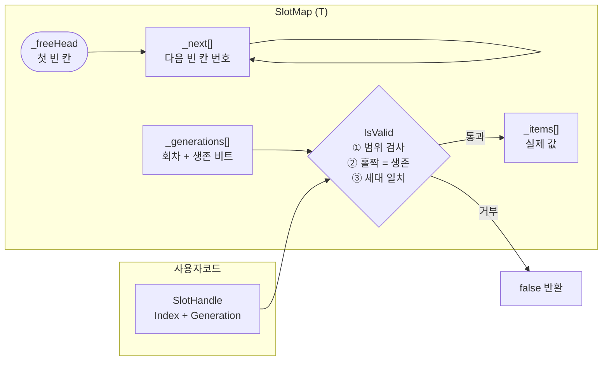
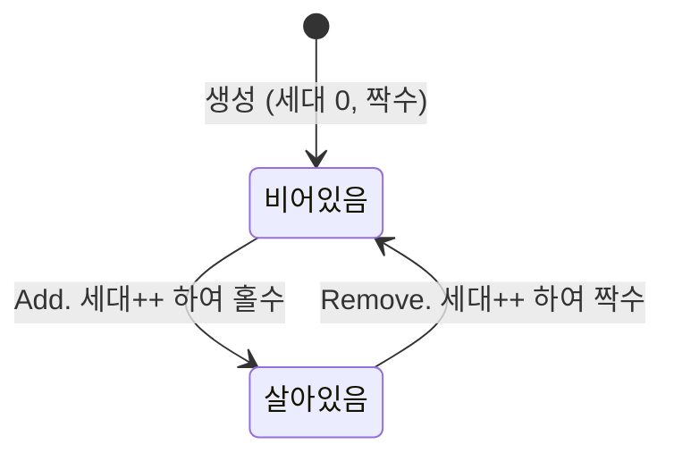

# 설계 노트

구조와 API, 그리고 만들면서 막혔던 개념들을 정리한 문서입니다. README가 "왜 그렇게 했나"를 다룬다면 여기는 **무엇이 어떻게 생겼나**를 봅니다.

관련 README 절: [변형 A. SlotMap](../README.md#변형-a-slotmapt), [변형 B. BlockAllocator](../README.md#변형-b-blockallocator)

---

## 시스템 아키텍처

### 전체 구조



세 배열의 길이는 **항상 같습니다.** 같은 인덱스 `i`가 세 배열에서 같은 슬롯의 서로 다른 측면을 가리킵니다.

| 배열 | 언제 유효한가 |
|---|---|
| `_items[i]` | 슬롯이 **살아있을 때** |
| `_next[i]` | 슬롯이 **비어 있을 때** (살아있으면 낡은 값이고 아무도 안 읽습니다) |
| `_generations[i]` | **항상** (하위 1비트는 생존 여부, 나머지는 발급 회차) |

### 슬롯의 생애



`Add`와 `Remove`가 각각 세대를 1씩 올리므로 **상태가 바뀔 때마다 최하위 비트가 토글됩니다.** 정수 하나가 "몇 번째 주인인가"와 "지금 살아있는가"를 동시에 표현합니다.

### free 체인이 동작하는 모습

```
용량 5, 1번과 3번이 비어있는 상태

index:      0        1        2        3        4
         ┌──────┐ ┌──────┐ ┌──────┐ ┌──────┐ ┌──────┐
_items   │  A   │ │      │ │  C   │ │      │ │  E   │
_next    │  -   │ │  3   │ │  -   │ │  -1  │ │  -   │
_gen     │  1   │ │  2   │ │  1   │ │  4   │ │  1   │
         └──────┘ └──────┘ └──────┘ └──────┘ └──────┘
                      ↑                  ↑
_freeHead = 1 ────────┘                  │
                      └── _next=3 ───────┘
                                         └── _next=-1 (체인 끝)
```

`Add`는 `_freeHead`가 가리키는 칸을 가져가고, `Remove`는 반납한 칸을 체인 **맨 앞**에 꽂습니다. 맨 뒤에 붙이려면 끝까지 걸어가야 해서 O(n)이 되므로, 앞에 꽂아 O(1)을 유지합니다. 그 결과 **가장 최근에 반납한 칸이 먼저 재사용됩니다(LIFO).**

이 LIFO 선택이 나중에 `BlockAllocator`에서 단편화를 두 배로 만드는 원인이 됩니다. [측정 기록](측정-기록.md#속도-136배를-얻으면서-단편화를-두-배로-잃었습니다)을 참고하세요.

### BlockAllocator, 가변 크기 블록 (변형 B)

칸 크기가 고정이 아니면 "3번 칸"이라는 번호를 못 매깁니다. 그래서 **관리 정보를 옆 배열이 아니라 데이터 사이에 심습니다.**

```
아레나 = byte[] 하나  (64바이트)

 0      4              20   24    28      40   44   48    60   63
[ 24 ][   payload   ][ 24 ][ 20 ][ pay ][ 20 ][ 21 ][ pay ][ 21 ]
 헤더                  푸터  헤더          푸터  헤더          푸터
 └────── 블록 24바이트 ─────┘└─ 블록 20바이트 ─┘└ 블록 20, 비었음 ┘

헤더와 푸터 = 블록 전체 크기 | (비었으면 1)       21 = 20 | 1
              크기가 4의 배수라 최하위 비트가 항상 비어 있습니다
```

**크기 자체가 다음 블록을 가리키는 링크**가 됩니다. `0 → 24 → 44 → 64(끝)`으로 걸으면 아레나 전체를 훑을 수 있고, 별도 인덱스가 필요 없습니다.

| 구성 요소 | 역할 |
|---|---|
| **헤더** (앞 4B) | 크기 + 빈 플래그. 다음 블록 위치 계산 |
| **푸터** (뒤 4B) | 같은 값의 사본. **앞** 블록의 시작을 O(1)로 역산 → 앞쪽 병합 |
| **빈 블록의 payload 앞 8B** | free 리스트의 `prev`/`next`. 빈 칸은 어차피 안 쓰니 공짜 |

```
빈 블록:   [헤더4 | prev4 | next4 | ...남은 payload... | 푸터4]
사용 블록: [헤더4 |        사용자 데이터              | 푸터4]
                   ↑ 할당되는 순간 링크는 덮어써집니다
```

`_freeHead`에서 `next`를 따라가면 **빈 블록만** 훑습니다. `SlotMap`의 `_freeHead`와 `_next[]`를 별도 배열 없이 재현한 것입니다.

### 상수

```
HeaderSize     4      푸터도 4
BlockOverhead  8      헤더 + 푸터
Alignment      4      모든 블록 크기는 4의 배수
MinPayload     8      빈 블록이 prev/next를 담아야 하므로
MinBlock      16      BlockOverhead + MinPayload
```

`MinPayload`가 4가 아니라 8인 이유가 명시적 free 리스트입니다. 링크 두 개를 빈 블록 안에 넣기로 한 순간, 빈 블록은 최소 8바이트의 payload를 가져야 합니다. 이 값이 안 맞으면 링크를 못 담는 12바이트 블록이 생겨 체인이 조용히 깨집니다.

---

## 핵심 기능

### SlotMap 공개 API

| 시그니처 | 설명 |
|---|---|
| `SlotMap(int capacity = 1024)` | 용량 지정 생성. 0 이하면 `ArgumentException` |
| `SlotHandle Add(T item)` | 빈 칸에 넣고 핸들 발급. 가득 차면 용량을 2배로 늘립니다 |
| `bool Remove(SlotHandle handle)` | 제거 성공 시 `true`. 무효 핸들이면 `false` |
| `bool TryGet(SlotHandle handle, out T value)` | 살아있으면 값과 함께 `true` |
| `int Count { get; }` | 살아있는 원소 수 |
| `Enumerator GetEnumerator()` | 살아있는 원소만 도는 열거자 |

밖에서 슬롯에 닿는 길은 **`SlotHandle` 뿐입니다.** 원시 인덱스를 받는 오버로드는 전부 `private`이고, `SlotHandle`의 생성자는 `internal`이라 발급 권한은 `SlotMap`만 갖습니다.

### 기능별 동작

**O(1) 할당과 반납.** free 체인의 머리를 뽑고 꽂는 것이 전부입니다. 탐색이 없습니다.

**이중 반납 차단.** 같은 칸을 두 번 반납하면 `_next[i] = i`가 되어 체인이 자기 자신을 가리킵니다. 이후 모든 `Add`가 같은 칸을 반환하며 데이터가 조용히 덮어써집니다. 생존 검사로 두 번째 반납을 거부합니다.

**옛 핸들 차단(세대).** 칸이 재사용되면 옛 인덱스가 새 주인을 가리킵니다. `Remove`가 세대를 올리는 것만으로 **그 칸을 가리키던 모든 옛 핸들이 한 번에 무효**가 됩니다. 옛 핸들 목록을 관리할 필요가 없습니다.

**타입에 따른 조건부 참조 정리.** `T`가 참조를 품은 타입일 때만 반납 시 슬롯을 비웁니다. `RuntimeHelpers.IsReferenceOrContainsReferences<T>()`는 JIT이 타입별 상수로 접기 때문에, `SlotMap<int>`로 만든 코드에서는 분기 자체가 사라집니다.

**자동 확장.** 가득 차면 용량을 2배로 늘립니다. 새 구간의 꼬리를 기존 `_freeHead`에 연결하므로, "가득 찼을 때만 확장한다"는 가정 없이도 옛 빈 칸이 유실되지 않습니다.

**할당 없는 순회.** 구조체 열거자를 쓰고 `IEnumerable<T>`를 구현하지 않습니다. `GetEnumerator()` 메서드만 있으면 `foreach`가 동작하므로(덕 타이핑) 인터페이스를 거치지 않아 박싱이 없습니다.

### BlockAllocator 공개 API

| 시그니처 | 설명 |
|---|---|
| `BlockAllocator(int capacity)` | 아레나 바이트 수. 4의 배수이고 `MinBlock`(16) 이상이어야 합니다 |
| `bool TryAlloc(int size, out int offset)` | **바이트 수**를 요청하고 위치를 받습니다. 값이 아니라 자리를 줍니다 |
| `bool Free(int offset)` | 반납. 양옆이 비었으면 자동으로 합칩니다 |
| `Span<byte> AsSpan(int offset)` | 그 블록의 payload를 여는 창문 |
| `AllocatorStats GetStats()` | 아레나를 걸으며 진단값 5개를 셉니다 |
| `FitPolicy Policy { get; set; }` | `First`(기본) 또는 `Best`. 빈 블록을 **고르는** 방법 |
| `FreeOrder Order { get; set; }` | `Lifo`(기본) 또는 `Address`. free 리스트에 **넣는** 순서 |
| `int[] DebugFreeList()` | 진단용. 체인을 따라가며 블록 시작 위치를 순서대로 |
| `int[] DebugFreeBlockStarts()` | 진단용. 아레나를 걸으며 빈 블록 시작 위치를 순서대로 |

### 두 축을 나눈 이유

`Policy`와 `Order`는 서로 다른 질문에 답합니다.

```
Policy   후보 중 무엇을 고를까      first = 처음 맞는 것,  best = 가장 딱 맞는 것
Order    후보를 어떤 순서로 볼까    lifo = 최근 해제순,   address = 주소 오름차순
```

둘을 갈라놓았기 때문에 [측정 기록](측정-기록.md#원인으로-지목한-것을-고쳤는데-효과가-없었습니다)에서 "단편화의 원인은 순서가 아니라 고르는 방법"이라는 결론이 나올 수 있었습니다. 한 축으로 뭉쳐놨으면 못 갈랐을 것입니다.

### 삽입은 한 함수가 전담합니다

리스트에 노드를 끼우는 자리가 셋인데(LIFO 삽입, 주소 순서 삽입, 분할 잔여물 삽입) 링크 조작은 `LinkFree` 하나에만 있습니다.

```csharp
private void LinkFree(int prev, int blockStart, int next)
```

`prev ↔ blockStart ↔ next` 세 노드 사이의 **링크 네 개**를 쓰고, 양 끝이 `-1`인 경우를 안에서 처리합니다. 그래서 호출부는 "누구와 누구 사이"만 정하면 됩니다.

| 호출부 | prev | next | 비용 |
|---|---|---|---|
| LIFO 삽입 | `-1` | `_freeHead` | O(1) |
| 주소 순서 삽입 | 걸어서 찾은 앞 노드 | 나보다 큰 첫 노드 | O(빈 블록 수) |
| 분할 잔여물 | 뽑아낸 블록의 옛 prev | 옛 next | **O(1)** |

세 번째가 O(1)인 것이 중요합니다. 분할된 나머지는 원래 블록 **안에** 있으므로 `prev < 잔여물 < next`가 자동으로 성립합니다. 원래 블록이 있던 리스트 자리를 그대로 물려받으면 되고, 걸어서 찾을 필요가 없습니다. 분할은 할당마다 일어나므로 여기에 O(n)이 붙으면 측정이 의미를 잃습니다.

```csharp
// TryAlloc: RemoveFree 전에 이웃을 뽑아둔다
var prevFree = ReadPrev(pos);
var nextFree = ReadNext(pos);
RemoveFree(pos);
```

**`RemoveFree` 앞이어야 합니다.** 뒤로 가면 이웃들이 이미 서로 이어붙은 뒤고, 곧이어 `WriteBlock`이 그 4바이트를 덮어씁니다.

### 두 진단 메서드가 핵심 불변식입니다

```
Order가 Address면   DebugFreeList() == DebugFreeBlockStarts()   순서까지
Order가 Lifo면      둘이 집합으로 같다
```

체인(빈 블록의 링크)과 아레나(헤더의 크기로 걷기)는 **같은 현실을 보는 두 개의 그래프**입니다. 이 둘이 어긋나면 리스트가 깨진 것입니다. 주소 순서 테스트 19개가 전부 이 한 줄로 환원됩니다.

`DebugFreeList()`에는 순환 방어가 들어 있습니다. 빈 블록은 `Capacity / MinBlock`개를 넘을 수 없으므로, 그보다 많이 걸었다면 체인이 자기 자신으로 돌아온 것입니다. 이 방어가 없으면 링크가 꼬였을 때 **테스트가 빨간불 대신 멈춥니다.** 열거자에서 한 번 겪은 실패 모양입니다.

`SlotMap`은 **값을 보관해주는 그릇**이고 `BlockAllocator`는 **자리를 나눠주는 관리인**입니다. 후자는 안에 뭐가 들어가는지 모릅니다.

**불변식**: `UsedBytes + FreeBytes + OverheadBytes == Capacity`. `GetStats()`가 아레나를 물리적으로 걸으며 이걸 검증하므로, free 리스트가 현실과 어긋나면 즉시 드러납니다. 실제로 3단계 버그를 이 가드가 잡았습니다.

### 측정용 계측

정책 비교를 위해 카운터를 붙여뒀습니다. 시간이 아니라 **탐색 횟수**가 주 지표입니다.

| 멤버 | 세는 것 |
|---|---|
| `ProbeCount` | 탐색 루프가 빈 블록을 들여다본 총 횟수 |
| `FailProbeCount` | 그중 **실패한** 탐색이 쓴 몫 |
| `AllocCount` | 성공한 할당 수 |
| `ProbesPerAlloc` | `(ProbeCount - FailProbeCount) / AllocCount` |
| `InsertProbeCount` | `PushFree`가 자리를 찾느라 걸은 노드 수 |
| `FreeCount` | 성공한 해제 수 |
| `InsertProbesPerFree` | `InsertProbeCount / FreeCount` |
| `ResetCounters()` | 워밍업 후 전부 0으로 되돌립니다 |

`ProbesPerAlloc`이 실패 몫을 빼는 이유는 분자와 분모가 같은 사건 집합을 세야 하기 때문입니다. 이걸 안 하고 재서 결론이 뒤집혔던 기록이 [측정 기록](측정-기록.md#비율-지표의-분자와-분모가-다른-사건을-세고-있었습니다)에 있습니다.

`InsertProbeCount`는 주소 순서 정책에서만 0이 아닙니다. **이걸 안 세면 `FindFit`에서 줄어든 탐색이 `PushFree`로 옮겨간 것을 절약으로 착각합니다.** 비용을 다른 주머니로 옮겨놓고 아꼈다고 하는 셈이죠. 그래서 총비용은 이렇게 봅니다.

```
총탐색/연산 = (ProbeCount + InsertProbeCount) / (AllocCount + FreeCount)
```

분자에 모든 탐색을, 분모에 모든 연산을 넣습니다. 같은 사건 집합입니다.

### 테스트

xUnit 테스트 **74개**입니다(`SlotMap` 39, `BlockAllocator` 35). 상당수가 실제로 겪은 버그를 하나씩 붙잡고 있습니다.

#### SlotMap, 39개

| 그룹 | 개수 | 대표 항목 |
|---|---|---|
| 생성자 | 3 | `capacity가_1이어도_동작한다` (경계값) |
| Add | 5 | `초기_체인이_전체_칸을_잇는다` |
| Remove | 6 | `이중_제거_후에도_체인이_망가지지_않는다` |
| 재사용 | 3 | `재사용_순서는_LIFO다` |
| TryGet | 4 | `저장된_마이너스1과_실패는_구분된다` |
| 세대 핸들 | 5 | `확장을_건너뛴_옛_핸들도_거부된다` |
| 확장 | 3 | `확장_후에도_기존_데이터가_살아있다` |
| GC 누수 | 1 | `참조_타입을_제거하면_GC가_수거한다` |
| 종합(랜덤) | 2 | `죽은_핸들은_언제나_거부된다` |
| 순회 | 7 | `중첩_순회는_서로_간섭하지_않는다` |

특히 **랜덤 스트레스 테스트 2종**이 손으로 짠 시나리오가 놓치는 조합을 잡습니다. 고정 시드를 써서 실패하면 그대로 재현됩니다.

- `랜덤_5000회_동안_불변식이_유지된다`. 매 스텝 `Count == 실제 생존 수`, 살아있는 핸들 재발급 없음, 값 무결성
- `죽은_핸들은_언제나_거부된다`. 죽은 핸들 20개를 매 스텝 다시 찔러 하나라도 통과하면 실패

#### BlockAllocator, 35개

| 그룹 | 개수 | 대표 항목 |
|---|---|---|
| 생성자 | 4 | `모든_바이트는_사용_빈공간_오버헤드_중_하나다` |
| TryAlloc | 8 | `연속_할당한_블록들은_겹치지_않는다` (실제 바이트로 확인) |
| Free | 5 | `같은_블록을_두_번_해제하면_거부된다` |
| AsSpan 검증 | 2 | `해제된_블록에는_스팬을_주지_않는다` |
| 재사용 | 3 | `할당_해제_1000회_반복이_공간을_잠식하지_않는다` |
| 분할 | 3 | `작은_요청이_큰_빈_블록을_통째로_먹지_않는다` |
| 병합 | 5 | `해제한_조각들을_합쳐야_큰_요청이_성공한다` |
| 데이터 무결성 | 3 | `이웃을_해제하고_다시_할당해도_내_데이터는_그대로다` |
| 단편화 | 1 | `걸러서_해제하면_외부_단편화가_남는다` |
| 종합(랜덤) | 1 | `랜덤_2000회_동안_불변식이_유지된다` |

병합 그룹 5개는 **1단계 구현에서 의도적으로 빨간불이었습니다.** 경계 태그를 넣기 전까지 정확히 그 다섯만 실패하는 것이 진도의 척도였습니다.

---

## 학습 노트: 개념 정리

만들면서 막혔던 것들과 그 답입니다. 코드보다 이해가 오래 남습니다.

### `_next`는 왜 덮어써도 되는가

`_next[i]`는 **i번 칸이 비어 있을 때만** 의미가 있습니다. 살아있는 칸의 `_next`는 낡은 값이고 아무도 읽지 않습니다.

```
Remove(0):  _next[0] = 3     ← 원래 1이었는데 3으로 덮어씁니다
```

옛 값 `1`은 "0번이 비어 있던 시절, 그때 다음 빈 칸은 1번"이라는 정보입니다. 그 사이 1번은 사용 중이 됐으니 **이미 틀린 정보**입니다. 계속 들고 있으면 오히려 위험합니다. 덮어쓰기는 사고가 아니라 **의도된 동작**입니다.

그리고 `_next[i] = i + 1`은 **초기 상태일 뿐**입니다. 쓰기 시작하면 체인 순서는 인덱스 순서와 무관해집니다.

```
Remove(2) → Remove(0) 순으로 지우면:  0 → 2 → 3
```

### "살아있다"는 무엇을 뜻하는가

배열의 각 칸은 두 상태 중 하나입니다.

| 상태 | 뜻 | free 체인에 | `TryGet` |
|---|---|---|---|
| 살아있음 | `Add`됐고 아직 `Remove` 안 됨 | 없음 | 가능 |
| 비어있음 | 한 번도 안 썼거나 `Remove`됨 | 있음 | 안 됨 |

문제는 이걸 **판단할 수단이 없었다**는 것입니다. `_items`를 봐도 모든 `int` 값이 유효한 데이터라 구분이 안 되고, `_next`도 "살아있음"을 뜻하는 값이 정해져 있지 않았습니다. free 체인을 훑으면 알 수 있지만 O(n)이라 O(1)이 목적인 자료구조에서 쓸 수 없습니다.

결국 **명시적으로 기록하는 수밖에 없습니다.** 처음엔 `bool[]`로, 나중에는 세대의 최하위 비트로 했습니다.

### `& 1`은 비트에서 어떻게 계산되나

2진수의 각 자리에는 정해진 값이 있습니다.

```
자리값:  ... 32  16   8   4   2   1
                                  ↑
                          여기만 홀수 (2⁰)
```

**2⁰ 자리만 홀수고 나머지는 전부 짝수입니다.** 짝수를 아무리 더해도 짝수이므로, 숫자 전체의 홀짝은 **마지막 자리 하나가 결정합니다.**

`&`는 같은 자리끼리 비교해 **둘 다 1일 때만 1**을 냅니다. `1`은 2진수로 `0001`이므로, `& 1`을 하면 마지막 자리를 뺀 모든 자리가 0이 됩니다.

```
    세대 6 :  0 0 0 1 1 0
    마스크 :  0 0 0 0 0 1
    ─────────────────────  &
    결과   :  0 0 0 0 0 0  = 0  → 짝수 → 비어있음

    세대 7 :  0 0 0 1 1 1
    마스크 :  0 0 0 0 0 1
    ─────────────────────  &
    결과   :  0 0 0 0 0 1  = 1  → 홀수 → 살아있음
```

**`% 2` 대신 `& 1`을 쓰는 이유**는 음수 때문입니다. `x % 2 == 1`은 `-3 % 2 == -1`이라 홀수 판정에 실패합니다. `& 1`은 그런 조건이 없습니다. 그리고 "비트를 플래그로 쓴다"는 의도를 코드가 직접 말해줍니다.

같은 논리를 확장하면 `& 3`은 `% 4`, `& 7`은 `% 8`과 같습니다. **2의 거듭제곱에서만** 성립하며, 메모리 정렬이나 해시 버킷 크기에 2의 거듭제곱이 자주 쓰이는 이유가 이것입니다.

`BlockAllocator`가 헤더의 최하위 비트를 빈 플래그로 쓰는 것도 같은 원리입니다. 모든 블록 크기가 4의 배수라 그 비트가 항상 0이고, 남는 자리이므로 공짜로 쓸 수 있습니다.

### `IsValid`가 왜 `SlotHandle`을 통째로 받아야 하나

인덱스와 세대가 둘 다 필요한데, 그 둘을 이미 묶어놓은 것이 `SlotHandle`입니다. 쪼개서 받으면 이런 게 가능해집니다.

```csharp
IsValid(handleA.Index, handleB.Generation);   // 컴파일 통과. 말이 안 됩니다
```

**함께 다녀야 하는 값은 묶어서 넘깁니다.** `SlotHandle`이라는 타입을 만든 이유가 "이 둘은 항상 짝"을 강제하려는 것인데, 분해해서 넘기면 만든 의미가 없습니다.

같은 이유로 공개 API는 전부 `SlotHandle`을 받습니다. 하나라도 `int`를 받는 메서드가 남으면 **거기가 세대 검사를 우회하는 뒷문**이 됩니다.

### `WeakReference` 테스트는 왜 그렇게 짜야 하나

객체를 **풍선**, 강한 참조를 **풍선 줄**이라고 해봅시다. GC는 아무도 줄을 잡고 있지 않은 풍선을 터뜨립니다.

확인하려는 것은 "SlotMap이 줄을 놓았는가"인데, 이건 직접 볼 수 없습니다(`_items`는 private). 그래서 **풍선이 터졌는지**를 대신 봅니다.

문제는 관찰하려면 그 풍선을 알아야 하는데, 줄을 잡으면 안 터진다는 것입니다. `WeakReference`가 이걸 해결합니다. **풍선에 붙이는 스티커**라고 보면 됩니다. 줄이 아니라서 GC의 생존 판정에 안 세지만, 이걸 통해 "아직 있나?"를 물어볼 수 있습니다.

그리고 검증이 성립하려면 **SlotMap 말고는 아무도 잡고 있으면 안 됩니다.**

```csharp
var data = new byte[1024];        // ← 테스트 메서드가 줄을 하나 잡았습니다
map.Add(data);                     // ← SlotMap도 잡았습니다 (줄 2개)
map.Remove(handle);                // ← SlotMap이 놓았습니다 (줄 1개)
GC.Collect();
Assert.False(weak.IsAlive);        // 풍선은 여전히 떠 있습니다 → 실패
```

C#에는 "이 지역 변수 이제 안 쓸게"를 선언할 방법이 없습니다. **확실한 건 메서드가 끝나면 지역 변수가 사라진다는 것뿐입니다.** 그래서 객체 생성과 `Add`를 별도 메서드에서 하고, 그 메서드가 반환되게 만듭니다. `[MethodImpl(MethodImplOptions.NoInlining)]`은 JIT이 그 메서드를 호출부에 펼쳐 넣어(인라인) 지역 변수가 되살아나는 것을 막습니다.

반환 타입에 객체 자체를 넣으면 안 됩니다. 받는 쪽 변수가 다시 붙잡기 때문입니다. 인덱스와 스티커만 돌려받습니다.

> **`static` 메서드와 `static` 필드는 다릅니다.** 헬퍼에 붙인 `static`은 "인스턴스 상태를 안 쓴다"는 표시일 뿐 GC와 무관합니다. 반면 정적 **필드**는 **GC 루트**라, 거기 담긴 객체는 프로그램이 끝날 때까지 수거되지 않습니다. 실무 메모리 누수의 흔한 원인입니다.

### `Enumerator`가 무엇이고 `MoveNext`는 누가 부르나

`foreach`는 문법 설탕입니다. 컴파일러가 이렇게 바꿉니다.

```csharp
foreach (var x in items) { ... }

// ↓ 컴파일 결과

var e = items.GetEnumerator();
while (e.MoveNext())        // ← 여기서 부릅니다
{
    var x = e.Current;
    ...
}
```

**`MoveNext`를 부르는 주체는 컴파일러가 만든 저 `while`입니다.** 그리고 반복문이 두 개라는 점이 헷갈리기 쉽습니다.

```
바깥 반복문 (컴파일러가 만든 while) → MoveNext() 호출, true면 본문 실행
안쪽 반복문 (MoveNext 내부)        → 살아있는 칸을 찾을 때까지 인덱스를 밉니다
```

열거자는 **책갈피**입니다. 컬렉션은 내용을, 열거자는 위치만 갖습니다. `_index`가 필드여야 하는 이유는 **호출 사이에 위치를 기억**해야 하기 때문입니다. 지역 변수면 매번 0부터 다시 시작합니다.

위치를 컬렉션이 아니라 별도 객체에 두는 이유는 **책 한 권에 책갈피를 여러 개 꽂을 수 있어야** 하기 때문입니다. `GetEnumerator()`가 호출될 때마다 새 책갈피를 만들어 주므로 중첩 순회가 서로 간섭하지 않습니다.

### `for`가 `foreach`보다 빠른가

배열과 `List<T>`에서는 **사실상 차이가 없습니다.** JIT이 `foreach`를 알아보고 직접 쓴 `for`와 거의 같은 기계어를 만듭니다.

진짜 느려지는 것은 `IEnumerable<T>` **인터페이스를 통해** 돌 때입니다. 열거자가 힙에 박싱되고(반복문마다 할당 1회) 호출이 인라인되지 않습니다. 이래서 이 프로젝트는 **구조체 열거자와 덕 타이핑**을 씁니다.

그리고 진짜 논점은 속도가 아니라 **API**입니다. `for`를 쓰려면 `Capacity`와 원시 인덱스 접근을 밖에 노출해야 하고, 그러면 세대 핸들로 막은 뒷문이 다시 열립니다.

마지막으로, 순회의 진짜 비용은 반복문 형태가 아니라 **밀집도**입니다. 용량 100만에 5만 개만 살아있으면 필요한 것의 20배를 읽습니다. 이게 10배, 20배 차이를 만들고 반복문 형태 차이는 여기 묻힙니다.

### 코드를 고쳤는데 동작이 그대로일 때

**빌드 산출물이 소스보다 오래됐는지 먼저 확인합니다.** 코드를 아무리 들여다봐도 안 보이는 게 당연합니다. 보고 있는 코드와 돌고 있는 코드가 다르니까요.

```
SlotMap.cs      22:21:30
FreeList.dll    22:07:19    ← 14분 전 빌드
```

`bin` 폴더의 DLL 시각과 소스 시각을 비교하면 5초에 판별됩니다. 테스트 러너에서 "실패한 테스트만 다시 실행"을 누르면 빌드를 건너뛰는 경우가 있어 이런 상황이 자주 생깁니다.

### `int` 하나에 여러 의미가 섞이는 코드

`BlockAllocator`는 모든 것이 `int`입니다. 크기도, 위치도, 링크도, 플래그가 섞인 원본도 전부요. **컴파일러가 이들을 구분해주지 않으므로 이름이 유일한 방어선입니다.**

특히 두 값이 항상 짝으로 다닙니다.

```
블록 전체 크기   걷기, 검사, 헤더와 푸터에 기록할 값
payload 길이     호출자에게 주는 값
                 둘의 차이가 정확히 BlockOverhead(8)
```

그래서 이름을 이렇게 갈라 씁니다.

| 이름 | 담는 것 | 쓰는 곳 |
|---|---|---|
| `blockSize` | 헤더와 푸터 포함 전체 | 걷기(`pos += blockSize`), 범위 검사, `WriteBlock` |
| `length` | payload만 | `AsSpan`이 반환할 창문 길이 |
| `raw` | 크기와 빈 플래그가 섞인 원본 | `ReadSize`와 `IsFree`가 각각 분해해 씁니다 |
| `blockStart` | 헤더가 있는 위치 | 모든 헤더 접근의 기준점 |
| `offset` | payload가 시작하는 위치 | 공개 API가 주고받는 값. `blockStart + HeaderSize` |

`raw`를 `size`라고 부르면 플래그가 붙은 값을 크기로 쓰게 되고, `blockSize`를 `length`라고 부르면 스팬이 이웃 블록을 침범합니다. `blockStart`와 `offset`이 4바이트 차이라는 것도 이름으로만 구분됩니다.

> **원칙.** 같은 타입이지만 다른 의미인 값에는 다른 이름을 줍니다. 타입 시스템이 안 막아주는 자리일수록 이름이 계약이 됩니다.

`SlotMap`에서 `SlotHandle`을 `readonly struct`로 만든 것도 같은 이유입니다. `Remove(int, int)`를 노출했을 때는 인덱스와 세대를 바꿔 넣어도 컴파일이 됐지만, 핸들 하나로 묶은 뒤에는 그럴 수가 없습니다. **이름으로 구분하는 것보다 타입으로 구분하는 쪽이 강합니다.**

---

## 이어서 볼 것

- [측정 기록](측정-기록.md) 밀집도와 할당 정책 측정
- [디버깅 기록](디버깅-기록.md) 만들면서 낸 버그와 회귀 테스트
- [VContainer 비교](vcontainer-비교.md) 원본 구현과의 차이
